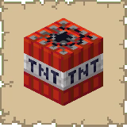
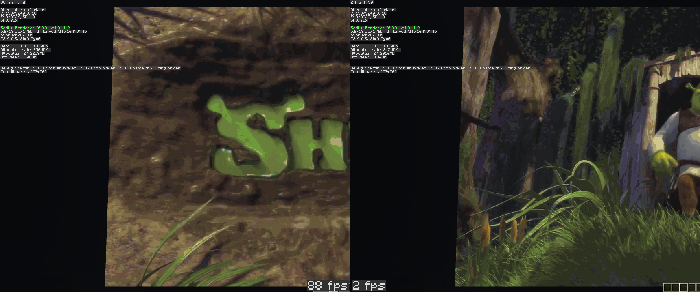

# UnsafeMaps - now requiring OpenGL 4.5!

### First off, as a word of warning:
This mod was specifically designed for the sole intention of getting very large displays made of maps to rapidly update without lagging the client to oblivion and back. 
This is not designed to be a generic "performance mod" and **it will not improve your performance in a virtually any other scenario**. 
It _may_ improve performance of loading very large displays initially, but once they're completely loaded, this mod is effectively pointless.
Please do not create issues or contact me regarding "why this mod isn't making the game run at 1 bajillion fps because I have 1 item frame with a map in it".

### What was wrong in Minecraft?
When map updates were received, the game would:
- Make multiple copies to any incoming map state updates (16384 bytes per copy).
- Call MapColor.getRenderColor(I) with the index, which _calculates_ the palette color, rather than looking it up (thus defeating the purpose of having a palette in the first place)
- Generates the map image on the CPU and then sends it off onto the GPU to simply just render.
- As a result, the CPU is essentially acting as a GPU for the purposes of rendering maps.

### What does this mod do to solve it?
- Reduce the amount of copies being done exactly 1 time (_once_, not to one). I'm still in the process of finding places where these copies are being made, but the work to solve the other issues are far better in improving performance.
- Generate a lookup table for the map color palette and use that instead of calculating it every single time, though this isn't completely necessary.
- Change a map texture's internal format from RGBA32 to simply RED - 4bpp to 1bpp - as this mod instead uploads the direct palette indexes directly the GPU.
- Upload the color palette as a texture to the GPU, such that a fragment shader can do a texelFetch() using the given indexes.
- Utilize OpenGL buffer objects to upload the indexes, and rotates between 3 buffers. The implementation is currently poor as it doesn't properly fence off writing, but it "works on my machine" currently.

### What are the gains?

Sample world containing 60x34 maps (7680x4352 - larger than 8K resolution!) rapidly updating at ~24fps.

Left is with UnsafeMaps, right is without. In both clients, they were running with Sodium + Lithium + Krypton.