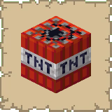

# UnsafeMaps

### What was wrong with Minecraft?
Simply put: copying. Every time the client receives a map item update, the pixel data gets copied multiple times in different areas, primarily in `MapState$UpdateData` and `MapRenderer$MapTexture`. Normally this makes sense - map updates aren't always meant to update the whole map (or the pixel data at all) and maps are not meant to serve as active displays for animated imagery or videos. Except I want to use it for those exact purposes, which is how UnsafeMaps came to be.

### Where is it wrong?
In `MapState$UpdateData.setColorsTo(MapState)`, vanilla clients will iterate over the entire 16kb array and copy each element one at a time. This also cannot be optimized down by the JIT to a single memcpy/System.arraycopy, as the start indexes (yes, _indexes_ - it iterates over it in 2D fashion) can vary. The solution is extremely simple: check if the incoming color data is 16kb (a "full map update") and if it is, just set `MapState.colors` to our incoming colors from `MapState$UpdateData`. We can do this because `MapState$UpdateData.colors` is set to a newly allocated array that isn't referenced or used anywhere else by `MapUpdateS2CPacket(PacketByteBuf)`. Therefore, it just makes more sense to just reference the incoming data rather than slowly iterate over it and do a byte-for-byte copy.

In `MapRenderer$MapTexture`, the story, once again, starts with the client iterating over the entire fixed-size 16kb color data in 2D fashion. This slightly makes sense as it calls `NativeImage.setPixelColor(x, y, color)`, but upon closer inspection, all `NativeImage.setPixelColor(x, y, color)` does is some pointer arithmatic (based on `x`, `y`) and calls `MemoryUtil.memPutInt(pointer, color)` to directly update the raw texture data. There are some checks done with `NativeImage.setPixelColor(x, y, color)` (such as checking to make sure we're dealing with an ABGR pixel format), but we're basically guaranteed none of these exceptions will arise due to how `NativeImageBackedTexture` is initialized. The naive fix would be to just remove the 2D loop all together in favor of a 1D loop, and then use `MemoryUtil.memIntBuffer(pointer, capacity)` to directly write our color data to the underlying image. Yes, this works - but this is essentially beating the tutorial boss.

The real culprit for poor performance when rapidly updating maps comes from `MapColor.getRenderColor(shade)`. This function computes a shade of a base color based on the input `shade`. Yes - _computes_ a shade. This involves division by a non-power-of-2 number, which absolutely _wrecks_ our performance. The solution becomes obvious when computation involves anything that involves expensive operations (in our case, division by non-power-of-2): generate a lookup table and use it!

Combine all of our optimization tricks and we can easily do update map displays up to 4K-equivalent with little performance loss! Now, as for why this is named "UnsafeMaps"... well, simply put, you shouldn't install this mod unless if you're planning on using Vidmap. It's not exactly well tested and was developed to chase after 8K displays, which if you probably can guess, doesn't and probably will never work _well_.

### Anything else?
I also added in a client-side command ("/create-display <width> <height>") that will generate a wall of sandstone and glowing item frames with maps sequentially laid out, starting from map ID 0. It will always have the frames facing south - it was added in simply just to make testing huge displays easily (placing 2040 maps by hand didn't sound fun in my head).